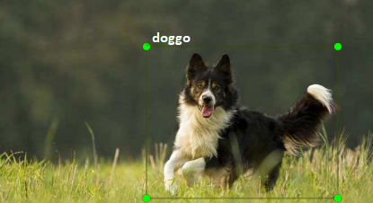

# yolo coordinates

 [](https://coveralls.io/github/epomatti/yolo-coords?branch=master)

A tiny helper lib to get YOLO labeling format `txt` coordinates as an array.

Get it from NPM:

```
npm i yolo-coords
```

Usage example:

```js
// reads class "16" coordinates from the txt file
const coords = require('yolo-coords')
const array = coords('16', 'sample.txt')
console.log(array)

// output
[ '0.785185', '0.420118', '0.385185', '0.828402' ]
```

The coordinates are also referred as 'labels' or 'annotations' and represent the position of an object within an imagem.



A YOLO `txt` file looks likes this:

```
15 0.235185 0.381657 0.396296 0.727811
16 0.785185 0.420118 0.385185 0.828402
```
